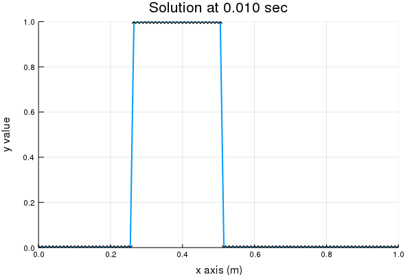

# 1D FVM

## Introduction
A simple jupyter notebook project solves one dimensional advection equation by finite volume method.

***
## Requirements
The code now works with Julia 1.0 and the require packages are **Printf**, **DelimitedFiles** and **Plots**.

***
## Code Framework

* **CaseConfig:**
A julia type contains configuration data of the model.

* **Cell:**
A mutable julia type contains data of each cell.

* **SolutionInitializer:**
A julia type initializes data in each cell (default to be a square wave).

* **SolutionWriter:**
A julia type writes solution data into files.

* **SolutionPlotter:**
A julia type plots figure and produce animation for solution data.

* **InterpolationFun:**
A function defines the interpolation function for reconstructing the variable on cell faces (default methods are **UPWIND**, **LINEAR** and **QUICK**).

* **timemarchingFun:**
A function defines the time marching function  (default methods are **RK1**, **RK2** and **RK4**).
***
 ## Start a simulation

1. **Setting configuration of the case**
```
mycase = CaseConfig(0, 1, 100, 2, 1, 500, 0.01, 1.0, UPWIND)
SHOW_CONFIG(mycase)
```

2. **Create grid structure**
```
mycells = Array{Cell}(undef, GET_NUM_CELLS(mycase))

for i = 1 : GET_NUM_CELLS(mycase)
    mycells[i] = Cell(mycase, i)
end
```
3.  **Initiallize the model**
```
myinit = SolutionInitializer(0.25,0.50)
INITIALIZE(myinit, mycase, mycells)
```
4.  **Start simulationl**
```
mywriter = SolutionWriter()
time = 0.0

for tSteps = 1 : mycase.NUM_TIME_STEPS
    
    timemarchingFun(mycase, mycells)
    
    time = mycase.TIME_STEPS_SIZE*tSteps
    
    WRITEFILE(mywriter, mycase, mycells, time)
    
end

println("complete!")
```

5.  **Plot solution data**
```
plotter = SolutionPlotter()

PLOTSOLUTION(plotter, mycase, mycells, time)

ANIMATESOLUTION(plotter, mycase)
```
6. **Result**<br>

***

## Furture works
* Add more interpolation functions and time marching functions.
* Reconstruct and simplify the code framwork.
* Add briefly introduction of equation in the problem.